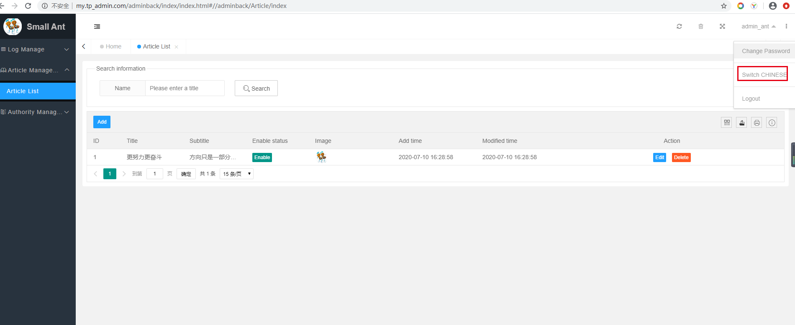
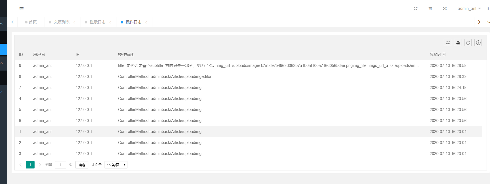
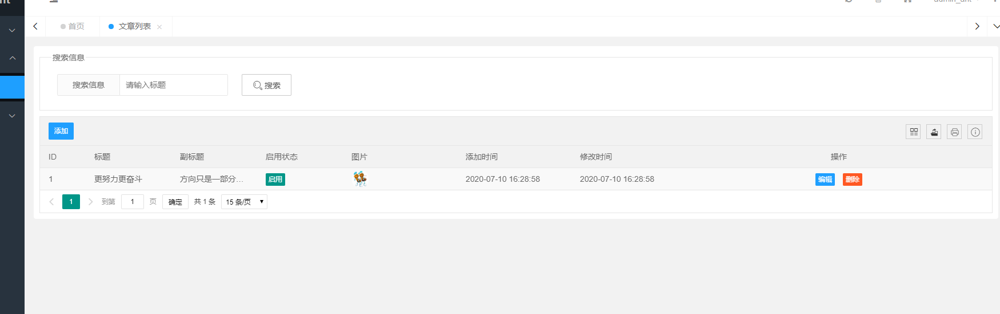
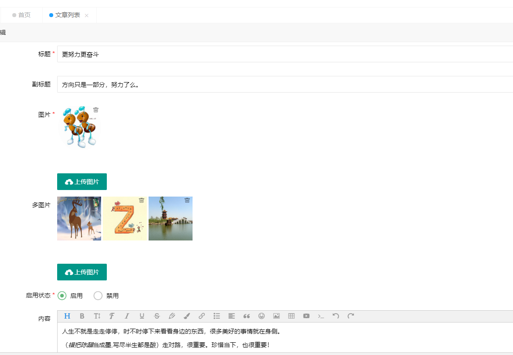
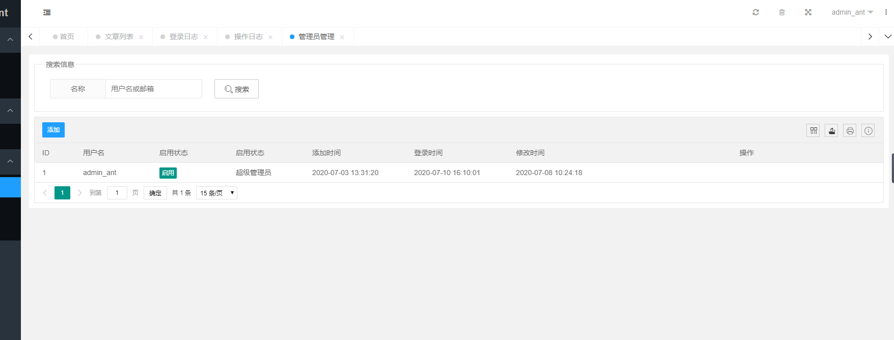
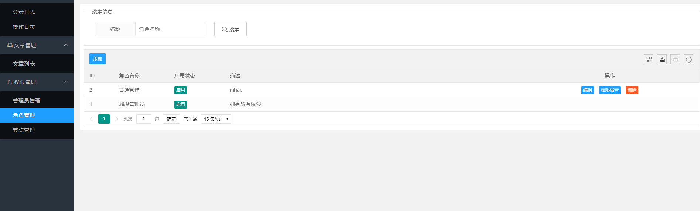
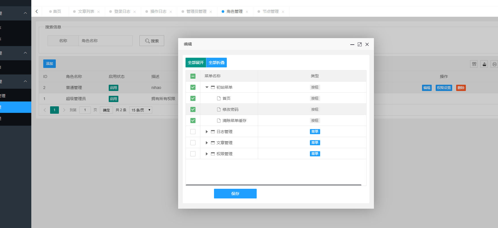
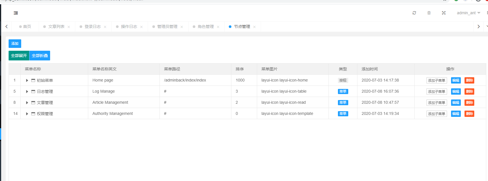

# Small Ant
thinkphp5.1.39 + layuimini2 realizes the management background of common functions, including but not only permission management, administrator management, Chinese and English switching, and template style public development.

It is recommended to have one star and one watch each. Open source is not easy, thanks for your support.
github:https://github.com/yangmingzhong/small_ant_mz_admin
gitee:https://gitee.com/yangmingzhong/small_ant_mz
## Special thanks
Open source php framework thinkphp5.1
Open source front-end framework https://www.layui.com/
Open source background layuimini https://gitee.com/zhongshaofa/layuimini

## First look at the effect (If github cannot be displayed, you can download it and look at the project imgscreens folder)
 

 

 

 

 

 

 

 

# QQ exchange group
## 1136512593

# Please refer to thinkphp5.1 for construction

# Reward the author (A penny is also love, thank you)

 

